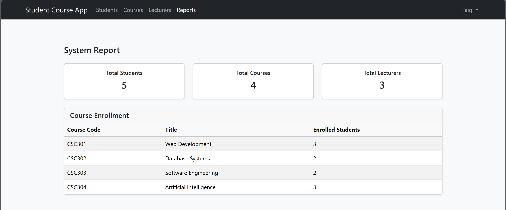
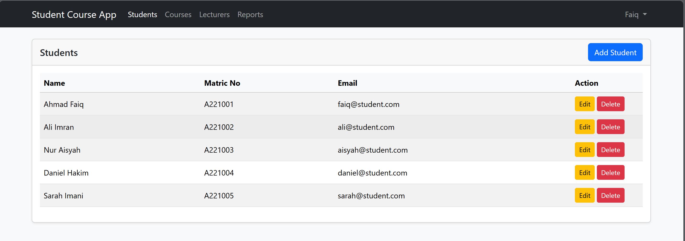
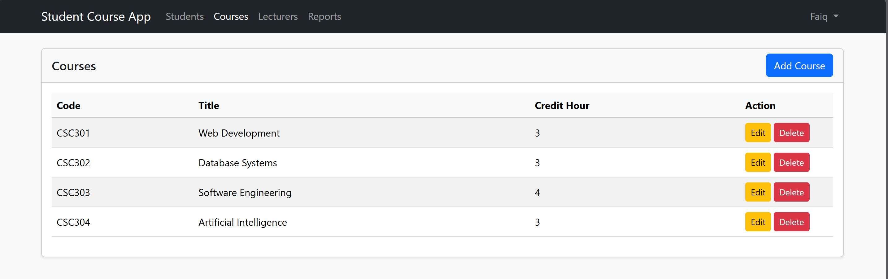
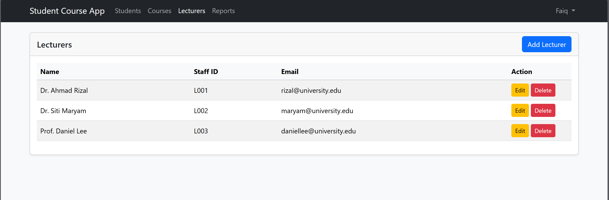
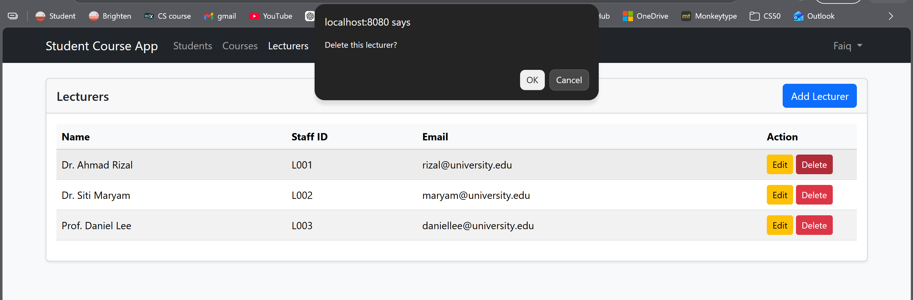

# Student Course Management System

A full-stack academic management system built with Laravel, MySQL, Docker, and Bootstrap for managing students, courses, lecturers, and reports in a centralized platform.

---

## Features

- User authentication and login system
- Student management (Create, Read, Update, Delete)
- Course management
- Lecturer management
- Student course enrollment system
- Reporting dashboard
- Responsive user interface
- Dockerized development environment
- MySQL relational database integration

---

## Technologies Used

### Backend
- Laravel 12
- PHP 8.2
- MySQL

### Frontend
- Blade Templating
- Bootstrap
- JavaScript
- Vite
- Node.js
- NPM

### DevOps / Deployment
- Docker
- Docker Compose
- Google Cloud Platform (Cloud Run, Cloud SQL, Cloud Build, GCR)

---

## Screenshots

### Dashboard


### Students


### Courses


### Lecturers


### Add Student Example
.png)

### Edit Student Example
.png)

### Delete Example


---

## Database Structure

Main tables used in the system:

- users
- students
- courses
- lecturers
- course_student (many-to-many relationship)

---

## Demo Login

```txt
Email: faiq@example.com
Password: password123
